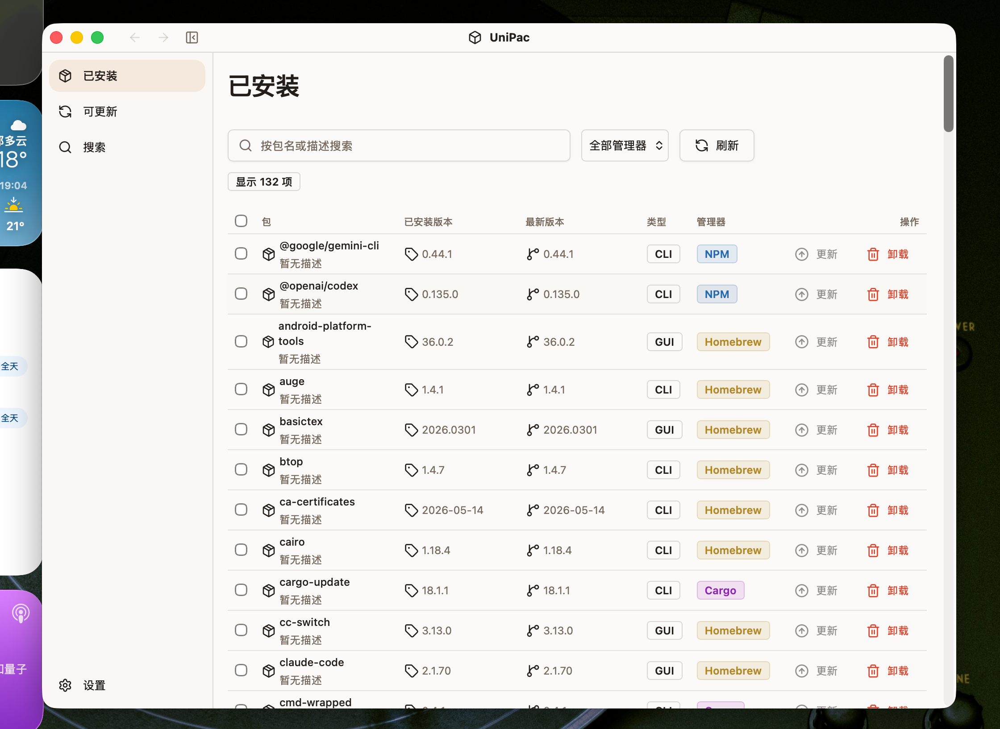

# UniPac

> Status: Work in Process.
> Expect incomplete features, rough edges, and changing APIs.

UniPac is a desktop package manager dashboard built with Wails, Go, and Vue.

The goal is to provide one place to inspect and operate on packages installed through different package managers, without making users known about each manager's command-line details.




## What It Does

UniPac is currently focused on:

- Discovering available package managers on the host machine.
- Listing installed packages through backend adapters.
- Caching installed package snapshots in SQLite.
- Showing installed and outdated package views in a Vue desktop UI.
- Exposing package-manager capabilities so the UI can enable only supported actions.
- Gradually adding search, install, uninstall, update, and version lookup workflows.

## Package Manager Support

The backend is adapter-based. Each adapter reports its own capabilities, and the frontend should treat manager IDs as opaque values returned by the backend.

Current adapter targets include:

- Homebrew
- npm
- pip
- pipx
- Cargo
- uv tool

Support is intentionally uneven while the project is under active development. Some managers can list packages reliably while other actions may still be disabled or incomplete.

## Tech Stack

- Wails v2 for the desktop shell and Go-to-frontend bindings.
- Go for package-manager discovery, command execution, registry orchestration, cache persistence, config, and logging.
- Vue 3 + TypeScript for the frontend.
- Vite for frontend development and builds.
- SQLite for cached package snapshots.
- Tailwind CSS and local shadcn-vue style primitives for UI components.

## Repository Layout

```text
.
├── app.go                  # Wails-facing backend API
├── main.go                 # Wails app setup
├── backend/
│   ├── adapters/           # Package-manager adapters
│   ├── cache/              # SQLite cache
│   ├── config/             # App config
│   ├── core/               # Manager domain types and registry
│   ├── logging/            # Logging setup
│   └── util/               # Shared backend helpers
├── frontend/
│   ├── src/                # Vue app
│   └── wailsjs/            # Generated Wails bindings
└── .agents/                # Architecture and agent development notes
```

## Development

Install the Wails CLI first if you do not already have it:

```sh
go install github.com/wailsapp/wails/v2/cmd/wails@latest
```

Install frontend dependencies:

```sh
cd frontend
npm install
cd ..
```

Run the app in live development mode:

```sh
wails dev
```

Build a redistributable app:

```sh
wails build
```

Run backend tests:

```sh
go test ./...
```

If Go cannot write to the default build cache in a sandboxed environment, use a writable cache path:

```sh
GOCACHE=/private/tmp/unipac-wails-go-build go test ./...
```

Run the frontend build directly:

```sh
cd frontend
npm run build
```

## Development Notes

- `frontend/wailsjs/` is generated by Wails. Do not edit it by hand.
- Frontend pages and components should call `frontend/src/lib/api.ts`, not generated Wails bindings directly.
- The backend registry is the source of truth for available package managers and capabilities.
- Adding a package manager should be a backend adapter change, followed by Wails binding regeneration when new app methods are exposed.
- UI availability should be driven by backend capabilities, not hardcoded manager names.

## Known Limitations

- The project is not production-ready.
- Package actions may require permissions depending on the package manager and host setup.
- Startup and refresh behavior may be affected by slow or failing package-manager commands.
- Some package-manager capabilities are intentionally disabled until their CLI behavior is reliable enough to expose.
- Generated bindings and frontend action wiring may change as backend workflows stabilize.

## License

MIT
